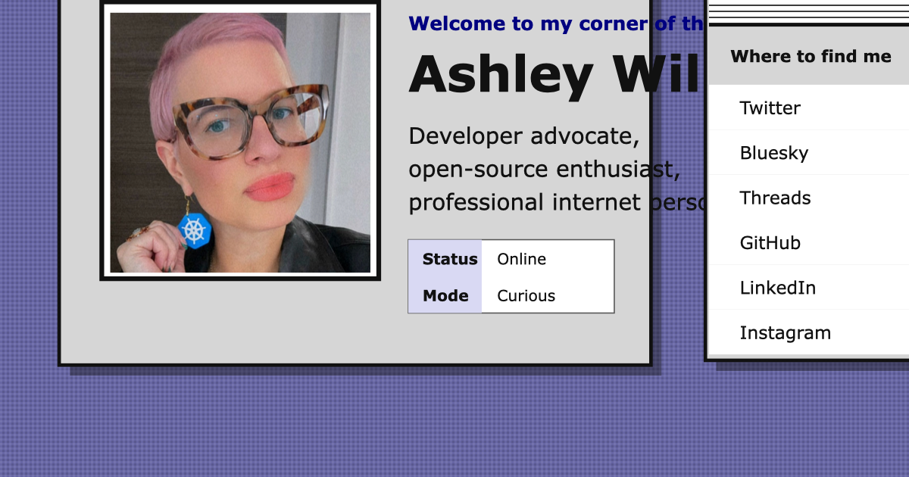
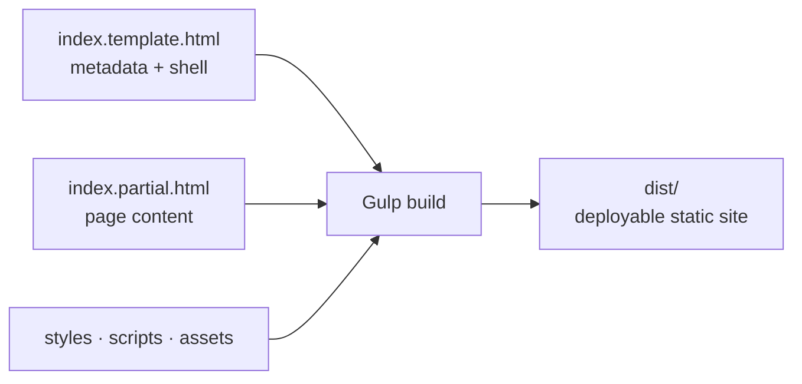

<p align="center">
  
</p>

<h1 align="center">Ashley Desktop</h1>

<p align="center">
  Ashley Willis's official corner of the internet, reimagined as a responsive
  Classic Mac OS-inspired desktop.
</p>

<p align="center">
  <strong><a href="https://ashleywillis.social">Open Ashley Desktop</a></strong>
  ·
  <a href="#getting-started">Run locally</a>
  ·
  <a href="#project-map">Explore the source</a>
</p>

<p align="center">
  <a href="https://ashleywillis.social">
    
  </a>
</p>

> **System status:** Internet connected<br>
> **Mission:** One human, six internet aliases, and several suspiciously
> clickable pixels.

[Ashley Desktop](https://ashleywillis.social) gives visitors a fast, accessible
path to Ashley's verified profiles while keeping the experience playful,
personal, and unmistakably hand-built.

## Highlights

🖥️ **A desktop that travels** — The platinum-window layout adapts from 320px
phones to wide desktop screens.

♿ **Accessible nostalgia** — Semantic HTML, visible focus, strong contrast,
comfortable touch targets, and reduced-motion support keep the experience
welcoming.

🌐 **Six equal aliases** — Twitter, Bluesky, Threads, GitHub, LinkedIn, and
Instagram receive the same visual weight.

✨ **Optional delight** — Wallpaper themes, a secret About box, and After Dark
reward exploration without hiding the core links.

## Getting started

### Prerequisites

- A recent version of [Node.js](https://nodejs.org/) and npm

### Install and run

```bash
npm install
npm run serve
```

The development server builds the site, opens a local preview, and rebuilds
whenever a file under `src/` changes.

## Available scripts

| Command | Description |
| --- | --- |
| `npm run serve` | Build, serve, watch, and reload the site locally |
| `npm run build` | Create a clean production build in `dist/` |
| `npm run tasks` | List the available Gulp tasks |

## Editing the site

- Update profile content and links in `src/index.partial.html`.
- Update metadata, social sharing tags, and the document shell in
  `src/index.template.html`.
- Update visual design and responsive behavior in `src/style.css`.
- Update progressive enhancements and Easter eggs in `src/script.js`.
- Add or replace local media in `src/assets/`.

Run `npm run build` after making changes. The build copies source assets into
`dist/`, injects the HTML partial into the template, and removes source-only
template files from the generated output.

## Project map



```text
.
├── build/                  # Gulp build tasks and utilities
├── src/
│   ├── assets/             # Profile image, favicon, and social cards
│   ├── index.partial.html  # Semantic page content
│   ├── index.template.html # Document shell and metadata
│   ├── script.js           # Progressive enhancements
│   └── style.css           # Design tokens, layout, and states
├── dist/                   # Generated production site
├── DESIGN.md               # Visual direction and implementation notes
├── PRODUCT.md              # Product purpose and design principles
└── package.json            # Scripts, dependencies, and build configuration
```

## Accessibility

Accessibility is part of the core experience. Changes should preserve semantic
landmarks, descriptive link text, visible keyboard focus, sufficient color
contrast, comfortable touch targets, and support for
`prefers-reduced-motion`.

## License

Licensed under the [MIT License](./LICENSE.txt).
